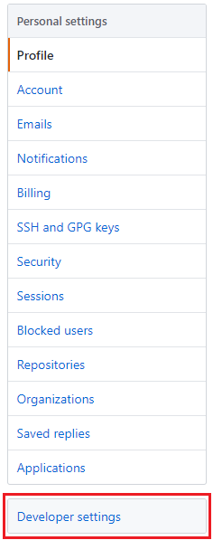

# Github Extract
Extract the commit history for a Github repository

### Steps
1. Login to github and in the top right corner select your profile. A drop down list will appear that looks like this. Select **Settings**.  

2. On the left side of the page there should be a list like this. Select **Developer Settings**.  

3. Under OAuth applications click **Register a new application**

4. A application needs to be registered with the following information:
  a. Application Name: Add a name for the application
  b. Homepage URL: Start with http://github.com
  c. Application description: A description for the application
  d. Authorization callback URL: http://localhost:1410
Once the above is complete click **Register application**  

5. Once the application has been created a Client Id and Client Secret will be returned. These will be hexidecimal values of varying lengths. These, along with the application name will be needed for the code to start the authentication process.

6. Open the R script file **Github Extract.R** and add the application name, client id (or ""key") and client secret to the _myapp_ variable on line 18.

7. On line 27 change the uri to be the repo for which the commit history is required. This will be in the format "https://api.github.com/repos/<owner>/<repo_name>/commits?per_page=50&page=" where <owner> needs to be replaced by the "owner" of the repo and <repo_name> needs to be replaced by the name of the repository.
  
8. Run the code
  
#### Notes
The API works on pagination with up to 100 commits returned per page. The code in this repo returns 50 records per page. The number of pages to loop through to get a complete list of commits can be increased by adding additional "pages" to the _pages_ variable.

#### Acknowledgements
This work was kick started using this website:
https://towardsdatascience.com/accessing-data-from-github-api-using-r-3633fb62cb08
