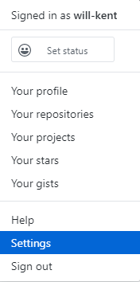

# Github Extract
Extract the commit history for a Github repository

### Steps
1. Login to github and in the top right corner select your profile. A drop down list will appear that looks like this. Select "Settings".  

