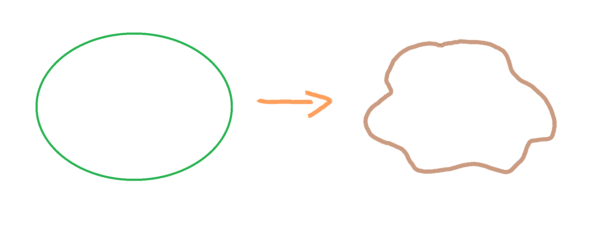
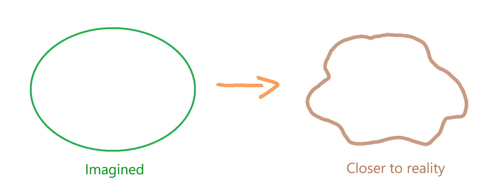

```{r setup, include=FALSE}
knitr::opts_chunk$set(echo = TRUE)
library(tmaptools) # for geocode_OSM
library(rgeos) # for readWKT
library(rgdal) # for CRS
library(ggplot2)
library(geosphere)
library(elevatr)
```

## Introduction {-#Introduction}
In a previous post I looked at [how far Uluru is from the sea](http://rpubs.com/will-kent/uluru-to-the-sea). In that analysis it was found Uluru is `679.35`kilometres from the sea and that the closest point on the coast is on the South Australian coast at the head of the Great Australian Bight. That original calculation was based on the _"as the crow flies"_ distance which is great, if you're a crow, but doesn't help us land based mammals to determine the distance we'd have to travel to get to the coast from Uluru. This post will look at determining how far a kangaroo would have to hop from Uluru to the sea.

``` {r crowflying, echo=FALSE, out.width='100%', fig.align = "center", fig.cap = "\\label{fig:figs}A crow flies above the undulations of the earth's surface but a kangaroo would have to navigate these mountains and valleys."}

```

## The Earth isn't round {-#the-earth-isnt-round}
Bare with me, this isn't a flat earth conspiracy. The Earth is often referred to as an oblate spheroid; a sphere that is a little fatter around the middle. The Earth's equator rotates faster than the poles and bulges outward by about 21 kilometres. The term oblate spheroid still conjures up an image of a uniform surface throughout the entirety of the planet, but this isn't true. The earth is a rock and like most rocks it comes with an uneven surface; it rises and falls.

``` {r earthsurface, echo=FALSE, out.width='100%', fig.cap = "\\label{fig:figs}The Earth is often imagined as an oblate spheroid but in reality it's a lumpy rock with an uneven surface."}

```

The uneven surface of our planet creates obstacles that a land based animal needs to navigate in order to reach a destination; they can't fly above it all. How could we calculate the distance to be travelled by land?

## Calculating distance {-#calculating-distance}

Before calculating the distance we'll set the starting location - Uluru - and the projection. A projection is the method by which a three dimensional coordinate system is displayed on a flat surface; in this case the widely used WGS84 projection for the project. The WGS84 projection is set using the `get_proj4` function from the `tamptools` package.

```{r vars, include = FALSE}
location <- "Uluru"

# We'll use the WGS84 projection for this project
wgs.84 <- get_proj4("WGS84", output = "character")
```

### Locating Uluru {-#locating-uluru}

The next step is to get the coordinates of Uluru based on the WGS84 projection. For this the `geocode_OSM` function from the `tmaptools` package is used. The `geocode_OSM` function uses the [Open Street Maps (OSM) Nominatim](http://nominatim.openstreetmap.org/) to retrieve the latitude and longitude for Uluru.

```{r get_uluru_coords, echo = TRUE}
loc <- geocode_OSM(location, projection = wgs.84)
loc_df <- as.data.frame(loc$coords)

# Get latitude and longitude of place of interest
longitude <- loc_df["x",]
latitude <- loc_df["y",]
```

The call to the OSM has placed Uluru at; longitude: `r longitude` and latitude: `r latitude`. These coordinates can be converted to a geometry object using the `readWKT` function from the `rgeos` package. The `readWKT` function reads the Well Known Text (WKT), created by concatenating the latitude and longitude into the format _POINT(longitude latitude)_, and outputs a spatial object in the specified WGS84.

```{r locgeometry, echo = TRUE}
# Get latitude and longitude of place of Uluru and create Well Known Text, and then geometry object
loc_txt <- paste("POINT(",longitude," ",latitude,")")
loc_wkt <- readWKT(loc_txt, p4s = CRS(wgs.84))
```

### Elevation {-#elevation}

With the location of Uluru on the Earth's surface known how high Uluru is above sea level can be calculating using the `get_elev_point` function from the `elevatr` package. The `elevatr` package provides access to several web services that provide elevation data. The web service used for this project is the [Amazon Web Service Terrain Tiles](https://registry.opendata.aws/terrain-tiles/) which provides a global dataset for bare-earth terrain heights. For Australia the elevation data is in a grid of either 5 metres for coastal regions or 90 metres for more remote regions.

```{r uluruelevation, echo = TRUE, message = FALSE, warning = FALSE}
# Check elevation of location of interest
uluru_alt <- elevatr::get_elev_point(loc_wkt, src = "aws")
```

The `get_elev_point` function accepts a point and returns the elevation. For Uluru the height above sea level is `r uluru_alt$elevation` metres.

### The coast {-#the-coast}
As in the previous post coastline data can be obtained from the <http://www.naturalearthdata.com> website using the `readOGR` function from the `rgdal` package.

```{r downloadfile}
download.file("http://www.naturalearthdata.com/http//www.naturalearthdata.com/download/10m/physical/ne_10m_coastline.zip", 
              destfile = 'coastlines.zip')

# Unzip coastline data and load into a SpatialLinesDataFrame object
unzip(zipfile = 'coastlines.zip', 
      exdir = 'ne-coastlines-10m')
coast <- readOGR("ne-coastlines-10m/ne_10m_coastline.shp", p4s = wgs.84)
```

```{r}
# Turn Shape file to data.frame - I don't think is required
# coast_df <- SpatialLinesDataFrame(coast,coast@data) 
```

### Crow Flies distance calculation {-#crow-flies-distance-calculation}
As in the previous post the distance from Uluru to the coast can be calculated using the `dist2line` function in the `geosphere` package.

```{r distcalc}
# Find the minimum distance to the coast in metres, as well as the point on the coast closest
# to the location of interest
dist_line <- dist2Line(loc_wkt, coast)
closest_longitude <- dist_line[2]
closest_latitude <- dist_line[3]
```

Unsurprisingly the distance from Uluru to the sea is `r dist_line` kilometres, which is what was found previously.


#Turn the line between Uluru and the closest point on the coast into a SpatialLines object
x <- c(longitude, closest_longitude)
y <- c(latitude, closest_latitude)
xy <- cbind(x,y)

sp_line <- SpatialLines(list(Lines(Line(xy), ID = "a")))

pts_2_sample <- 10000

# Break the line into n regular intervals and create a dataframe of these, adding the location
# of the point of interest along with the point on the coast
spdf <- spsample(x = sp_line, n = pts_2_sample, type = "regular") 
points <- as.data.frame(spdf)
points <- as.data.frame(rbind(xy[1,], points, xy[2,]))

# Get the distance between sample points
dist_bw_pts <- dist_line[1] / (pts_2_sample + 1)

# Plot on map with line from location of interest to the coast
ggplot() +
  geom_path(data = coast, aes(x = long, y = lat, group = group)) +
  geom_point(data = data.frame(loc_wkt), aes(x = x, y = y), colour = "red") +
  geom_path(data = points, aes(x = x, y = y), colour = "green") +
  scale_x_continuous(limits = c(110, 155)) +
  scale_y_continuous(limits = c(-45, -5)) +
  coord_fixed()


# Now get elevation of points, a SpatialPointsDataFrame is returned, turn that to a dataframe
# and add distance, in kiLometres, from location of interest.
elevations <- elevatr::get_elev_point(points, prj = wgs.84 ,src = "aws")
elevations_df <- as.data.frame(elevations)
elevations_df <- cbind(elevations_df, "distance" = (as.numeric(row.names(elevations_df)) - 1) * dist_bw_pts)

# Now plot the elevation profile from location of interest to coast
ggplot(elevations_df) +
  geom_line(aes(x = (distance/1000), y = elevation)) +
  scale_x_continuous(name = "Distance (km)") +
  scale_y_continuous(name = "Elevation (m)") +
  ggtitle("Elevation Profile") +
  theme_bw()

# For each point calculate the absolute elevation distance from point a to point b
first_elevation <- elevations_df[1,1]
elevations_df <- cbind(elevations_df, "next_elevation" = c(first_elevation, head(elevations_df$elevation, -1)))
elevations_df <- cbind(elevations_df, "elevation_diff" = abs(elevations_df$elevation - elevations_df$next_elevation))

# a2 + b2 = c2
distance <- sum(sqrt(dist_bw_pts^2 + elevations_df$elevation_diff^2))
distance