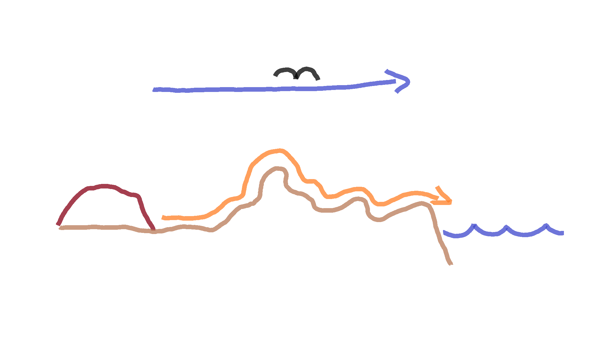

```{r setup, include=FALSE}
knitr::opts_chunk$set(echo = TRUE)
library(tmaptools) # for geocode_OSM
library(rgeos) # for readWKT
#library(maptools)
#library(sf)
library(rgdal) # for CRS
library(raster)
library(ggplot2)
library(geosphere)
library(elevatr)
library(rgbif)
library(sp)
```

## Introduction
In a previous post I looked at [how far Uluru is from the sea](http://rpubs.com/will-kent/uluru-to-the-sea). In that analysis it was found Uluru is `679.35`kilometres from the sea and that the closest point on the coast is on the South Australian coast at the head of the Great Australian Bight. That original calculation was based on the _"as the crow flies"_ distance which is great, if you're a crow, but doesn't help us land based mammals to determine the distance we'd have to travel to get to the coast from Uluru. In this post I'll look at determining how far a kangaroo would have to hop from Uluru to the sea.

``` {r mobListScreenShot, echo=FALSE, out.width='100%'}

```

```{r vars, include = FALSE}
location <- "Uluru"
pts_2_sample <- 10000
```